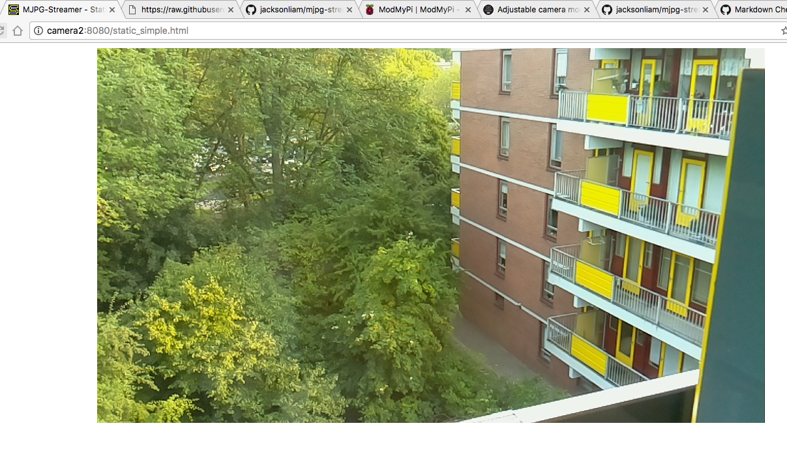

# Raspberry Pi - MJPG-streamer as a service

# What do you need

## Hardware
 * A Raspberry Pi (preferably a 2 or 3). My experience with the built-in wifi of the RP 3 is that is works better than the Realtek or WiPi dongles.
 * A Raspberry Pi camera (I have used the v1)
 * Optionally a case like: https://www.modmypi.com/raspberry-pi/camera/camera-cases/nwazet-pi-camera-box-bundle-case,-lens-and-wall-mount-b-plus

## Software
 * Raspbian
 * MJPG-streamer built with raspicam support: https://github.com/jacksonliam/mjpg-streamer
 * Some support files found in this repo


# Quick start

## Camera
* connect and configure Raspberry Pi camera board. https://www.raspberrypi.org/documentation/usage/camera/README.md
* check that raspivid can record video from the camera.


## Building mjpg-streamer
* clone repo: https://github.com/jacksonliam/mjpg-streamer
```
git clone https://github.com/jacksonliam/mjpg-streamer.git
```
* cd into source dir `cd mjpg-streamer`
* Build (see also https://github.com/jacksonliam/mjpg-streamer):
    * cd mjpg-streamer-experimental
    * make
    * sudo make install

## Installing the web i/f files
In the same directory (mjpg-streamer-experimental)
```
sudo mkdir /usr/local/share/mjpg-streamer
sudo cp -R www /usr/local/share/mjpg-streamer/
```

## Installling the plugin libs
In the same directory (mjpg-streamer-experimental)
```
sudo mkdir /usr/local/lib/mjpg-streamer
sudo cp *.so /usr/local/lib/mjpg-streamer
```

## Setting path for dynamic libraries

* clone this repository
* `cd raspi-mjpg-streamer`
* copy the ld config file
```
sudo cp mjpg-streamer-ld.conf /etc/ld.so.conf.d/mjpg-streamer.conf
```
* re-scan dynamic libraries
```
sudo ldconfig
```

## Check whether mjpg-streamer can be run
If your path includes `/usr/local/bin` (in which mjpg-streamer will have been installed by the default build process), 
then check if you can succesfully run:
```
mjpg_streamer -o "output_http.so -w /usr/local/share/mjpg-streamer/www" -i "input_raspicam.so -fps 10 --width 1024 --height 576"
```
If you test this as user *pi*, user *pi* should be part of group *video*


## Create user
Create a user, e.g. user *webcam* and add it to group *video*.
```
sudo adduser webcam
sudo adduser webcam video
```

## Install service files

Copy the service and default files from this repo to the right system directories.

```
sudo cp cammjpgstreamer.service /etc/systemd/system
sudo cp mjpg-streamer-default /etc/default/mjpg-streamer
```

## Enable the service
* Run `sudo systemctl daemon-reload` to scan the new service file.
* Enable the service by issuing the command: `sudo systemctl enable cammjpgstreamer.service`


## Start the service
* `sudo systemctl start cammjpgstreamer.service`


## See the results

* Use a browser on a computer connected to the same network as the raspberry pi.
* http://<raspberry pi adres or hostname>:8080/




TODO: Create a patch file to correct aspect ratio's of images in web interface (4:3 -> 16:9)


